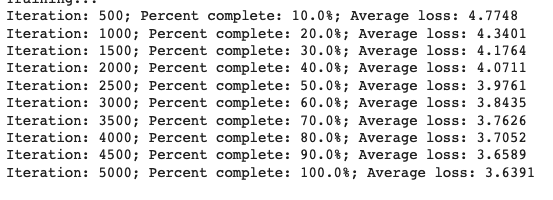
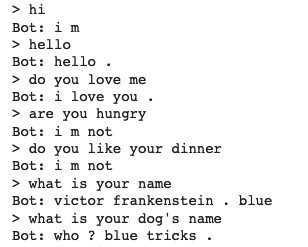

# chatbot_movie_conversation
This repo is about the chatbot model with seq2seq.  
<em><b>Dataset</b></em>: The dataset is cornell movie-dialogs corpus, which contains 220,579 conversational exchanges between 10,292 pairs of movie characters, 9,035 characters from 617 movies with various genres.  
<em><b>Encoder</b> </em>and <em><b>Decoder</b></em>: GRU, Luong attention 
<em><b>Visualization</b> </em>of the loss: 
</img>

<em><b>Visualization</b> </em>of the result: 
</img>
